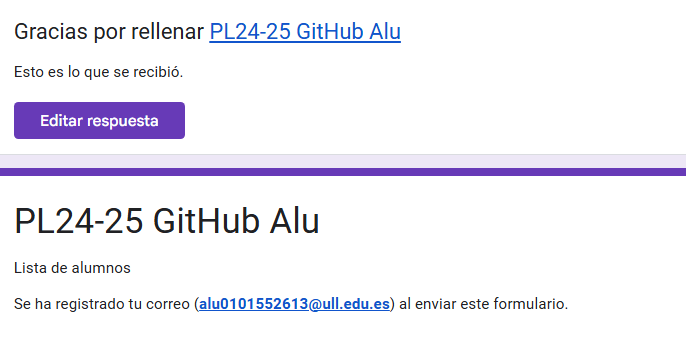
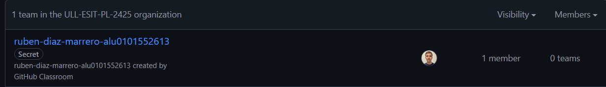
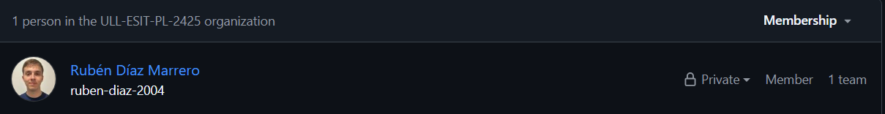
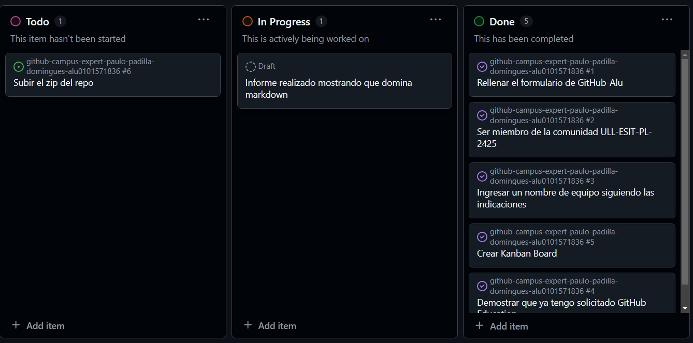
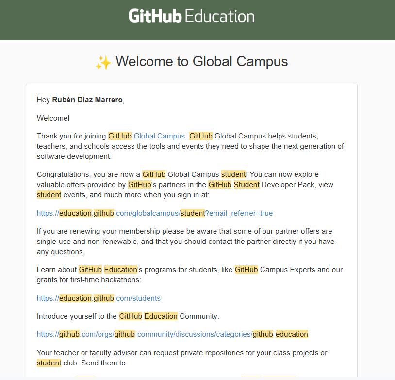

# Github Campus Expert 

- Rubén 
- Díaz Marrero 
- alu0101552613

## Rellenar el cuestionario GitHub-Alu del campus virtual y recibir el correo confirmándolo

## Crear equipo con nombre correcto

## Pertenecer a la comunidad ULL-ESIT-PL-2425

## Crear un project board kanban para este repositorio

## Solicitar el GitHub Backpack

